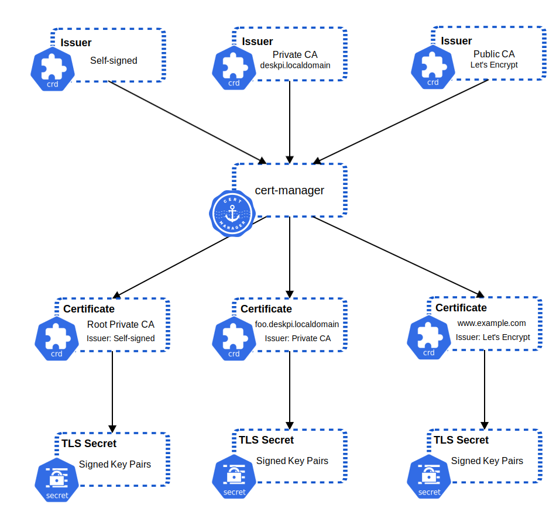

# Role definition for installing [cert-manager](https://cert-manager.io/).

```
├── roles
│  ├── cert-manager-install
|  |  ├── defaults
|  |  |  ├── main.yml
|  |  ├── tasks 
|  |  |  ├── main.yml  
|  |  ├── templates
|  |  |  ├── ca-issuer.yml.j2
|  |  |  ├── self-signed-issuer.yml.j2
|  |  |  ├── lets-encrypt-issuer.yml.j2
```

This structure houses the [Ansible Role](https://docs.ansible.com/ansible/latest/playbook_guide/playbooks_reuse_roles.html#roles) for installing the [cert-manager](https://cert-manager.io/) package, which adds certificates and certificate issuers as resource types in Kubernetes clusters, and simplifies the process of obtaining, renewing and using those certificates.



### Synopsis

This role does the following:

1. Creates a namespace for the cert-manager deployment.
2. Deploys the [cert-manager Helm chart](https://cert-manager.io/docs/installation/helm/).
3. Configures the CRD's:
    - ClusterIssuer for the Self-Signed Issuer.
    - Certificate and ClusterIssuer for the Private CA.
    - ClusterIssuer for Let's Encrypt (if enabled)

### References

https://cert-manager.io/docs/installation/helm/
https://picluster.ricsanfre.com/docs/certmanager/
